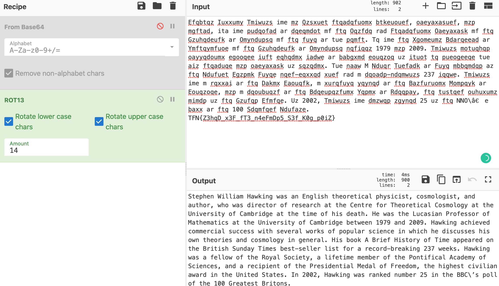

# Black Hole _[EASY]_

This is my Write Up for the "Black Hole" challenge from Hack The Box.

Like so often we are given a zip file called Blackhole.zip, naturraly we unzip it using cli:

```shell
unzip Blackhole.zip
```

It seems the Zip contained another zip called 'archive.zip' , so lets try and open that one.

we got a file called 'hawkins' it seems to be an image file, not really tho..
Is there a hidden message in this image? after some googling i found out about a tool called steghide.

steghide allowed me to look for a hidden message withing this file. Thanks @nieg for pointing in this direction.

I ran steghide like this:

```shell
steghide extract -sf hawking
```

nice! we get a file named Flag.txt.
It seems its content in encoded:

```shell
UldaeFluUnhlaUJKZFhoNGRXMTVJRlJ0YVhkMWVuTWdhVzFsSUcxNklGRjZjM2gxWlhRZ1puUnhZV1J4Wm5WdmJYZ2dZblJyWlhWdmRXVm1MQ0J2WVdWNVlYaGhjM1ZsWml3Z2JYcHdJRzFuWm5SaFpDd2dhWFJoSUdsdFpTQndkV1J4YjJaaFpDQmhjaUJrY1dWeGJXUnZkQ0J0WmlCbWRIRWdUM0Y2Wm1SeElISmhaQ0JHZEhGaFpIRm1kVzl0ZUNCUFlXVjVZWGhoYzJzZ2JXWWdablJ4SUVkNmRXaHhaR1YxWm1zZ1lYSWdUMjE1Ym1SMWNITnhJRzFtSUdaMGNTQm1kWGx4SUdGeUlIUjFaU0J3Y1cxbWRDNGdWSEVnYVcxbElHWjBjU0JZWjI5dFpYVnRlaUJDWkdGeWNXVmxZV1FnWVhJZ1dXMW1kSEY1YldaMWIyVWdiV1lnWm5SeElFZDZkV2h4WkdWMVptc2dZWElnVDIxNWJtUjFjSE54SUc1eFptbHhjWG9nTVRrM09TQnRlbkFnTWpBd09TNGdWRzFwZDNWNmN5QnRiM1IxY1doeGNDQnZZWGw1Y1dSdmRXMTRJR1ZuYjI5eFpXVWdhWFZtZENCbGNXaHhaRzE0SUdsaFpIZGxJR0Z5SUdKaFltZDRiV1FnWlc5MWNYcHZjU0IxZWlCcGRIVnZkQ0IwY1NCd2RXVnZaMlZsY1dVZ2RIVmxJR0ZwZWlCbWRIRmhaSFZ4WlNCdGVuQWdiMkZsZVdGNFlYTnJJSFY2SUhOeGVuRmtiWGd1SUZSMVpTQnVZV0YzSUUwZ1RtUjFjWElnVkhWbFptRmtheUJoY2lCR2RYbHhJRzFpWW5GdFpIRndJR0Y2SUdaMGNTQk9aSFZtZFdWMElFVm5lbkJ0YXlCR2RYbHhaU0J1Y1dWbUxXVnhlSGh4WkNCNGRXVm1JSEpoWkNCdElHUnhiMkZrY0MxdVpIRnRkM1Y2Y3lBeU16Y2dhWEZ4ZDJVdUlGUnRhWGQxZW5NZ2FXMWxJRzBnY25GNGVHRnBJR0Z5SUdaMGNTQkVZV3R0ZUNCRllXOTFjV1pyTENCdElIaDFjbkZtZFhseElIbHhlVzV4WkNCaGNpQm1kSEVnUW1GNlpuVnlkVzl0ZUNCTmIyMXdjWGxySUdGeUlFVnZkWEY2YjNGbExDQnRlbkFnYlNCa2NXOTFZblZ4ZW1ZZ1lYSWdablJ4SUVKa2NXVjFjSEY2Wm5WdGVDQlpjWEJ0ZUNCaGNpQlNaSEZ4Y0dGNUxDQm1kSEVnZEhWemRIRmxaaUJ2ZFdoMWVIVnRlaUJ0YVcxa2NDQjFlaUJtZEhFZ1IzcDFabkZ3SUVWbWJXWnhaUzRnVlhvZ01qQXdNaXdnVkcxcGQzVjZjeUJwYldVZ1pHMTZkM0Z3SUhwbmVXNXhaQ0F5TlNCMWVpQm1kSEVnVGs1UFhPS0FtV1VnWW1GNGVDQmhjaUJtZEhFZ01UQXdJRk5rY1cxbWNXVm1JRTVrZFdaaGVtVXVEUXBVUms1N1dqTm9jVVJmZUROR1gyWlVNMTl1TkdWR2JVUndOVjlUTTJaZlN6Qm5YM0F3YVZwOUlBPT0=
```

This string seems to be base64 encoded twice, who knows why, cuz this doesnt make it any harder.
Lets decode this in the browser:

```JavaScript
const x = atob(atob('UldaeFluUnhlaUJKZFhoNGRXMTVJRlJ0YVhkMWVuTWdhVzFsSUcxNklGRjZjM2gxWlhRZ1puUnhZV1J4Wm5WdmJYZ2dZblJyWlhWdmRXVm1MQ0J2WVdWNVlYaGhjM1ZsWml3Z2JYcHdJRzFuWm5SaFpDd2dhWFJoSUdsdFpTQndkV1J4YjJaaFpDQmhjaUJrY1dWeGJXUnZkQ0J0WmlCbWRIRWdUM0Y2Wm1SeElISmhaQ0JHZEhGaFpIRm1kVzl0ZUNCUFlXVjVZWGhoYzJzZ2JXWWdablJ4SUVkNmRXaHhaR1YxWm1zZ1lYSWdUMjE1Ym1SMWNITnhJRzFtSUdaMGNTQm1kWGx4SUdGeUlIUjFaU0J3Y1cxbWRDNGdWSEVnYVcxbElHWjBjU0JZWjI5dFpYVnRlaUJDWkdGeWNXVmxZV1FnWVhJZ1dXMW1kSEY1YldaMWIyVWdiV1lnWm5SeElFZDZkV2h4WkdWMVptc2dZWElnVDIxNWJtUjFjSE54SUc1eFptbHhjWG9nTVRrM09TQnRlbkFnTWpBd09TNGdWRzFwZDNWNmN5QnRiM1IxY1doeGNDQnZZWGw1Y1dSdmRXMTRJR1ZuYjI5eFpXVWdhWFZtZENCbGNXaHhaRzE0SUdsaFpIZGxJR0Z5SUdKaFltZDRiV1FnWlc5MWNYcHZjU0IxZWlCcGRIVnZkQ0IwY1NCd2RXVnZaMlZsY1dVZ2RIVmxJR0ZwZWlCbWRIRmhaSFZ4WlNCdGVuQWdiMkZsZVdGNFlYTnJJSFY2SUhOeGVuRmtiWGd1SUZSMVpTQnVZV0YzSUUwZ1RtUjFjWElnVkhWbFptRmtheUJoY2lCR2RYbHhJRzFpWW5GdFpIRndJR0Y2SUdaMGNTQk9aSFZtZFdWMElFVm5lbkJ0YXlCR2RYbHhaU0J1Y1dWbUxXVnhlSGh4WkNCNGRXVm1JSEpoWkNCdElHUnhiMkZrY0MxdVpIRnRkM1Y2Y3lBeU16Y2dhWEZ4ZDJVdUlGUnRhWGQxZW5NZ2FXMWxJRzBnY25GNGVHRnBJR0Z5SUdaMGNTQkVZV3R0ZUNCRllXOTFjV1pyTENCdElIaDFjbkZtZFhseElIbHhlVzV4WkNCaGNpQm1kSEVnUW1GNlpuVnlkVzl0ZUNCTmIyMXdjWGxySUdGeUlFVnZkWEY2YjNGbExDQnRlbkFnYlNCa2NXOTFZblZ4ZW1ZZ1lYSWdablJ4SUVKa2NXVjFjSEY2Wm5WdGVDQlpjWEJ0ZUNCaGNpQlNaSEZ4Y0dGNUxDQm1kSEVnZEhWemRIRmxaaUJ2ZFdoMWVIVnRlaUJ0YVcxa2NDQjFlaUJtZEhFZ1IzcDFabkZ3SUVWbWJXWnhaUzRnVlhvZ01qQXdNaXdnVkcxcGQzVjZjeUJwYldVZ1pHMTZkM0Z3SUhwbmVXNXhaQ0F5TlNCMWVpQm1kSEVnVGs1UFhPS0FtV1VnWW1GNGVDQmhjaUJtZEhFZ01UQXdJRk5rY1cxbWNXVm1JRTVrZFdaaGVtVXVEUXBVUms1N1dqTm9jVVJmZUROR1gyWlVNMTl1TkdWR2JVUndOVjlUTTJaZlN6Qm5YM0F3YVZwOUlBPT0='))
console.log(x)

//Output:
x = `Efqbtqz Iuxxumy Tmiwuzs ime mz Qzsxuet ftqadqfuomx btkeuouef, oaeyaxasuef, mzp mgftad, ita ime pudqofad ar dqeqmdot mf ftq Oqzfdq rad Ftqadqfuomx Oaeyaxask mf ftq Gzuhqdeufk ar Omyndupsq mf ftq fuyq ar tue pqmft. Tq ime ftq Xgomeumz Bdarqeead ar Ymftqymfuoe mf ftq Gzuhqdeufk ar Omyndupsq nqfiqqz 1979 mzp 2009. Tmiwuzs motuqhqp oayyqdoumx egooqee iuft eqhqdmx iadwe ar babgxmd eouqzoq uz ituot tq pueogeeqe tue aiz ftqaduqe mzp oaeyaxask uz sqzqdmx. Tue naaw M Nduqr Tuefadk ar Fuyq mbbqmdqp az ftq Ndufuet Egzpmk Fuyqe nqef-eqxxqd xuef rad m dqoadp-ndqmwuzs 237 iqqwe. Tmiwuzs ime m rqxxai ar ftq Dakmx Eaouqfk, m xurqfuyq yqynqd ar ftq Bazfuruomx Mompqyk ar Eouqzoqe, mzp m dqoubuqzf ar ftq Bdqeupqzfumx Yqpmx ar Rdqqpay, ftq tustqef ouhuxumz mimdp uz ftq Gzufqp Efmfqe. Uz 2002, Tmiwuzs ime dmzwqp zgynqd 25 uz ftq NNO\’e baxx ar ftq 100 Sdqmfqef Ndufaze.
TFN{Z3hqD_x3F_fT3_n4eFmDp5_S3f_K0g_p0iZ}`

```

We got some sort of unreadable Text coupled with what seems to be a flag.

```
HTB{this_is_the_usu4l_f0rmat_for_flags}
TFN{Z3hqD_x3F_fT3_n4eFmDp5_S3f_K0g_p0iZ}
```

similiarities are striking! why? well cuz its a caesar cipher.. how do we know? only the letters are affected, 'TFN' is 'HTB' shifted by 14, so they must be using ROT14. Give it a try on cyberchef:


